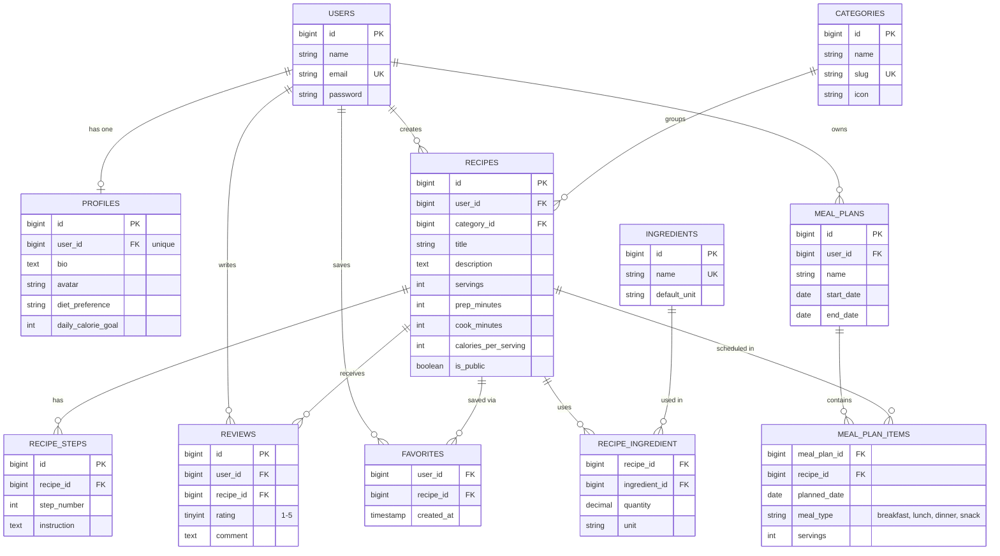

# Database Design — Entity Relationship Diagram

This document describes the database schema of **Mealmate** (recipe collection and weekly meal planner) and every Eloquent relationship used in the project.

## 1. Entity Relationship Diagram

## 2. Relationship Summary

| Type | Relationship | Eloquent |
|---|---|---|
| One-to-One | `User` ↔ `Profile` | `hasOne` / `belongsTo` |
| One-to-Many | `User` → `Recipe` | `hasMany` / `belongsTo` |
| One-to-Many | `User` → `Review` | `hasMany` / `belongsTo` |
| One-to-Many | `User` → `MealPlan` | `hasMany` / `belongsTo` |
| One-to-Many | `Category` → `Recipe` | `hasMany` / `belongsTo` |
| One-to-Many | `Recipe` → `RecipeStep` | `hasMany` / `belongsTo` |
| One-to-Many | `Recipe` → `Review` | `hasMany` / `belongsTo` |
| Many-to-Many + pivot data | `Recipe` ↔ `Ingredient` (pivot `recipe_ingredient`, columns `quantity`, `unit`) | `belongsToMany` + `withPivot` |
| Many-to-Many + pivot data | `MealPlan` ↔ `Recipe` (pivot `meal_plan_items`, columns `planned_date`, `meal_type`, `servings`) | `belongsToMany` + `withPivot` |
| Many-to-Many | `User` ↔ `Recipe` as favorites (pivot `favorites`) | `belongsToMany` + `withTimestamps` |
| Has-Many-Through | `User` → `Review` through `Recipe` (reviews received on the user's recipes) | `hasManyThrough` |
| Has-Many-Through | `Category` → `Review` through `Recipe` | `hasManyThrough` |

## 3. Categories (seeded)

The `categories` table is populated by a seeder with the eight built-in categories:

| Name | Slug |
|---|---|
| Breakfast | `breakfast` |
| Lunch | `lunch` |
| Dinner | `dinner` |
| Snacks | `snacks` |
| Drinks | `drinks` |
| Desserts | `desserts` |
| Vegetarian | `vegetarian` |
| Healthy & Low Calorie | `healthy-low-calorie` |

## 4. Design Notes

- **Unique constraints:** `profiles.user_id`, `categories.slug`, `ingredients.name`, (`reviews.user_id`, `reviews.recipe_id`) so a user can review a recipe only once, (`favorites.user_id`, `favorites.recipe_id`), and (`recipe_ingredient.recipe_id`, `recipe_ingredient.ingredient_id`) so an ingredient is listed once per recipe.
- **Ordered steps:** (`recipe_steps.recipe_id`, `recipe_steps.step_number`) is unique, so each step number appears once per recipe.
- **Meal planner:** `meal_plan_items` is a pivot between `meal_plans` and `recipes` that carries `planned_date`, `meal_type`, and `servings`. The same recipe can appear several times in one plan (for example on different days), so it has no unique constraint on the pair.
- **Rating range:** `reviews.rating` accepts values 1 to 5, enforced by validation.
- **Cascade rules:** deleting a user cascades to their profile, recipes, reviews, favorites, and meal plans. Deleting a recipe cascades to its steps, reviews, favorites, ingredient links, and meal plan items. Deleting a meal plan cascades to its items. Deleting a category or an ingredient is restricted while recipes still use it.
- **Totals** such as average rating and total calories per meal plan day are computed from `reviews` and `meal_plan_items` and are not stored.
